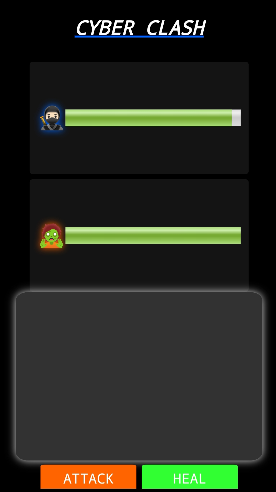

## ⚔️ CYBER CLASH
Cyber-Clash is a simple rush-fight browser game where players battle enemies using attack and heal mechanics. The game includes health management, critical hit probability, and character selection features.

---

## 🌐 Live Demo
👉 https://rishabh0789.github.io/cyber.clash/

---

## ✨ Features
- ⚔️ Attack & Heal mechanics
- 🎲 Randomized healing system
- 💥 Critical hit system
- 🎭 Character selection

---

## 🛠️ Technologies Used
- 🌐 HTML
- 🎨 CSS
- ⚡ JavaScript
- 🐙 Git & GitHub (Version Control & Hosting)
- 📝 WebCode

---

## 🏷️ Version History

### 🚀 v1.2 (Latest)
- 👥 More Player Options
- ⚡ Performance Optimization

### 🔄 Previous Updates
- 🔄 Reset Button
- ⚡ Performance Optimization

---

## 🚧 Future Updates
- 🛡️ Block Button  
- 👾 More Enemy Types  
- ⚡ Further performance improvements

---

## 🎮 How to play

- Choose your character before starting the fight

- Each character has their own **health bar**

- 🩹 Heal button adds **random health between 10 – 25**  
- 💥 There is a **20% chance of a critical hit**, dealing **15 damage** 
- Defeat the enemy before your health reaches zero


---
   
## 🚀 Installation Guide

Follow these steps to run **Cyber Clash** on your local system.

### 📥 Step 1 — Clone the Repository

Open your terminal or command propt and run:

```bash
git clone https://github.com/your-username/cyber.clash.git
```

### 📂 Step 2 — Open the Project Folder

```bash
cd cyber.clash
```

### ▶️ Step 3 — Run the Project

Since this is a browser-based project, simply open the main file:

* Locate **index.html**
* Double click it
  **OR**

Run this command:

```bash
start index.html
```

### 🌐 Step 4 — Play in Browser

The game will open in your default browser.
Now you can start playing and testing the features.

### ⚠️ Optional (Recommended for Developers)

If you are using VS Code:

1. Install **Live Server extension**
2. Right click on `index.html`
3. Click **Open with Live Server**

This gives better performance and auto-reload support.

---

## 🧑‍💻Author/Creator
Name : Rishabh Raj<br>
Role : Beginner Web Developer<br>
Interest : Coding, Learning new technologies, Gaming<br>
Contact : [rishabh078buisness@gmail.com](mailto:rishabh078buisness@gmail.com)<br>
> ⚠️ Note: AI tools were used to assist with certain parts of the development process, especially in logic design and problem-solving.
